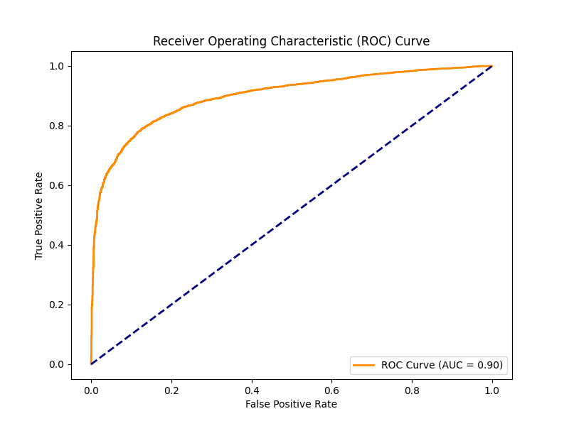
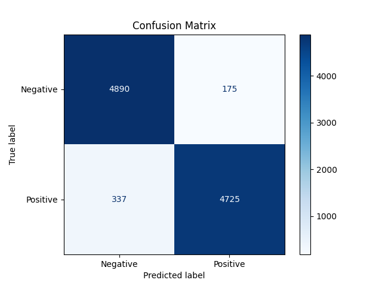
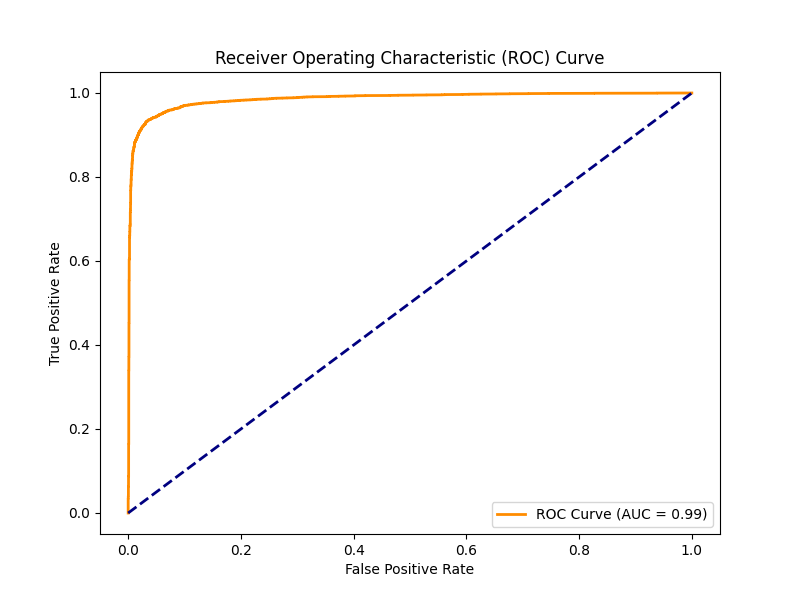

# End-to-End MLOps Pipeline for Stock Sentiment Analysis

This is a comprehensive project demonstrating a full-cycle, production-ready MLOps pipeline. It ingests real-world financial data, processes it, trains models, tracks experiments, and serves live sentiment analysis results via an interactive dashboard.

A live deployment of this project is hosted and available for viewing:

**[http://sent.strategiainvest.com.br:8080](http://sent.strategiainvest.com.br:8080)**

The following services are available at these paths:
* **Dashboard:** `http://sent.strategiainvest.com.br:8080/dashboard/`
* **Airflow:** `http://sent.strategiainvest.com.br:8080/airflow/`
* **MLflow:** `http://sent.strategiainvest.com.br:8080/mlflow/`

### API Endpoints

The project includes a Flask API (`app.py`) to serve the processed sentiment data. The following endpoints are available and proxied through `http://sent.strategiainvest.com.br:8080/api/v1/`:

* **`GET /api/v1/sentiments/summary`**
    * **Description:** Fetches the single latest sentiment score (from the "Sentiment Thermometer") for *all* tickers, sorted from most positive to most negative.
    * **Live URL:** [http://sent.strategiainvest.com.br/api/v1/sentiments/summary](http://sent.strategiainvest.com.br/api/v1/sentiments/summary)

* **`GET /api/v1/sentiment/<ticker_code>`**
    * **Description:** Fetches the single latest sentiment score for *one specific ticker*.
    * **Example:** [http://sent.strategiainvest.com.br/api/v1/sentiment/PETR4](http://sent.strategiainvest.com.br/api/v1/sentiment/PETR4)

* **`GET /api/v1/sentiment/<ticker_code>/news`**
    * **Description:** Fetches the detailed history of the last 3 months of news articles that were processed to calculate the sentiment for *one specific ticker*.
    * **Example:** [http://sent.strategiainvest.com.br/api/v1/sentiment/PETR4/news](http://sent.strategiainvest.com.br/api/v1/sentiment/PETR4/news)

* **`GET /api/v1/sentiment/<ticker_code>/timeseries`**
    * **Description:** Fetches the complete historical time series of aggregated sentiment scores for *one specific ticker*, ordered by date.
    * **Example:** [http://sent.strategiainvest.com.br/api/v1/sentiment/PETR4/timeseries](http://sent.strategiainvest.com.br/api/v1/sentiment/PETR4/timeseries)

* **`GET /health`**
    * **Description:** A simple health check endpoint to confirm the API container is running and responsive.
    * **Live URL:** [http://sent.strategiainvest.com.br/health](http://sent.strategiainvest.com.br/health)

---

## Table of Contents
1.  [Business Problem & Solution](#1-business-problem--solution)
2.  [Technical Architecture & Pipeline](#2-technical-architecture--pipeline)
3.  [Model Evaluation](#3-model-evaluation)
4.  [Deployment Guide](#4-deployment-guide)
    * [Step 1: Clone Repository](#step-1-clone-the-repository)
    * [Step 2: Manual Data Setup](#step-2-manual-data-setup)
    * [Step 3: DVC Remote Storage Setup](#step-3-dvc-remote-storage-setup)
    * [Step 4: Environment Configuration (.env)](#step-4-environment-configuration-env)
    * [Step 5: Build and Run the Application](#step-5-build-and-run-the-application)
    * [Step 6: Accessing Services](#step-6-accessing-services)
    * [Step 7: Finding Login Credentials](#step-7-finding-login-credentials)

---

## 1. Business Problem & Solution

### The Problem
For investors in the Brazilian stock market (B3), market sentiment is a powerful, yet difficult to quantify, driver of asset prices. Manually sifting through thousands of news articles to gauge the sentiment for specific stocks is an impossible task. This creates a need for an automated, reliable system to aggregate and analyze this sentiment data in near real-time.

### The Solution
This project implements an end-to-end MLOps pipeline that automates this entire process:

1.  **Data Ingestion:** Automatically scrapes financial news from sources like InfoMoney and fetches a list of relevant assets from external APIs.
2.  **Data & Model Versioning:** Uses **DVC** to version control large data files (raw text, word embeddings, trained models) alongside the code, ensuring full reproducibility.
3.  **Experiment Tracking:** Uses **MLflow** to log all training parameters, metrics, and model artifacts, allowing for easy comparison and registration of the best-performing models.
4.  **Orchestration:** Uses **Apache Airflow** to schedule and run two distinct pipelines:
    * A **training pipeline** that retrains the sentiment models on a weekly schedule.
    * An **inference pipeline** that runs every 4 hours to analyze new articles, calculate sentiment scores, and update a "Sentiment Thermometer" in the database.
5.  **Serving:** A **Flask API** serves the aggregated sentiment data from a PostgreSQL database, which is then consumed by a **Streamlit** dashboard for visualization.

This creates a self-sustaining system that continuously provides actionable sentiment data for investment analysis.

---

## 2. Technical Architecture & Pipeline

This project is built as a set of containerized microservices managed by Docker Compose, all derived from a single `Dockerfile` for consistency.

### Core Technologies
* **Containerization:** Docker & Docker Compose
* **Pipeline Orchestration:** Apache Airflow
* **Data & Model Versioning:** DVC
* **Experiment Tracking:** MLflow
* **ML Framework:** TensorFlow 2.x (Keras)
* **Models:** Custom Transformer Encoder & Baseline Logistic Regression
* **Backend & API:** Flask, Gunicorn, PostgreSQL, SQLAlchemy
* **Frontend (Dashboard):** Streamlit
* **Data Ingestion:** Playwright, BeautifulSoup, Requests
* **Reverse Proxy:** Nginx

### Pipeline Flow

The system is orchestrated by Airflow, which manages two key DVC pipelines:

#### A. The Training Pipeline (Weekly)
This DAG is responsible for retraining the sentiment models to prevent model drift and ensure new vocabulary is incorporated.
1.  `dvc pull`: Downloads the version-controlled raw data (`B2W-Reviews01.csv`, `cc.pt.300.vec`).
2.  `dvc repro evaluate`: This command triggers the full DVC pipeline:
    * **`prepare_embeddings`**: Converts the large text-based fastText word vectors (`.vec`) into a highly optimized binary format (`.bin`) for faster loading during training.
    * **`process_data`**: Cleans, transforms (binary classification), balances, and splits the raw `B2W-Reviews01.csv` training data into `train.csv`, `val.csv`, and `test.csv`.
    * **`train` & `train_baseline`**: Trains the two sentiment analysis models. The specific architectures are detailed in the [Model Architectures Explained](#model-architectures-explained) section below.
    * **`evaluate` & `evaluate_baseline`**: Generates final evaluation metrics (`scores.json`) and visualization plots (Confusion Matrix, ROC Curve) from the test set, all tracked by DVC.

#### B. The Inference Pipeline (Every 4 hours)
This DAG is the live, operational part of the project.
1.  **`dvc repro scrape_articles fetch_stock_codes`**: Runs the Python scrapers (`scraper.py`, `get_stock_codes.py`) to fetch the latest news articles and stock tickers.
2.  **`dvc push`**: Pushes the new raw data (news CSV, tickers JSON) to the DVC remote (S3).
3.  **`run_inference`**:
    * Loads the model currently tagged as "**Production**" from the **MLflow Model Registry**.
    * Calculates a proximity-weighted sentiment score for each stock ticker mentioned in each new article. This complex logic is detailed in the [Proximity-Weighted Sentiment Algorithm](#proximity-weighted-sentiment-algorithm) section below.
4.  **`store_results`**:
    * Saves the detailed per-article, per-ticker weighted sentiment score to the `news_sentiment_history` table in the PostgreSQL database.
    * Calculates an aggregated 3-month moving average for each ticker and upserts it into the `sentiment_thermometer` table.

This data is then immediately available to the Flask API and the Streamlit Dashboard.

### Model Architectures Explained

A key part of this project is the comparison between two different models for the sentiment analysis task. Both models are trained in the `train` and `train_baseline` DVC stages.

#### 1. Baseline Model: Averaged Embeddings + Classifier
*(Implemented in `src/ml/train_baseline.py`)*

This model serves as a simple, fast-to-train benchmark. It determines sentiment by "averaging" the meaning of all words in the review, ignoring their order and context relative to each other.

The architecture is:
1.  **Input:** A sequence of integers representing the review text.
2.  **Embedding Layer:** Converts the integers into dense vectors using the pre-trained fastText `embedding_matrix`.
3.  **PositionalEncoding:** The custom `PositionalEncoding` layer is still applied to add order information.
4.  **GlobalAveragePooling1D:** This is the key step. It takes the sequence of word vectors (e.g., 200 vectors of size 300) and computes a single average vector (of size 300) that represents the entire review. This step loses all information about word order and context.
5.  **Dense Layers:** This final average vector is passed through two `Dense` (fully-connected) layers and a `Dropout` layer for regularization.
6.  **Output:** A single neuron with a `sigmoid` activation function, outputting a probability between 0 (Negative) and 1 (Positive).

This model is conceptually similar to a Logistic Regression performed on the average of all word embeddings in the text.

#### 2. Main Model: Custom Transformer Encoder
*(Implemented in `src/ml/train.py` using custom classes from `src/ml/transformer_layers.py`)*

This is a sophisticated model based on the architecture from the "Attention Is All You Need" paper. It is designed to read the entire review at once and weigh the importance of each word relative to every other word, thus capturing complex context and long-range dependencies.

The architecture is built from three custom-defined Keras layers:

* **`PositionalEncoding` (`transformer_layers.py`):**
    Since the Transformer has no built-in sense of order (like an RNN), we must manually inject information about word position. This layer adds a unique positional encoding vector (calculated using sine and cosine functions of different frequencies) to each word embedding based on its position in the sequence.

* **`MultiHeadAttention` (`transformer_layers.py`):**
    This is the core of the Transformer. Instead of just looking at one word, it allows the model to look at a word and ask, "How relevant are all the *other* words in this sentence to *this specific word*?" It's "Multi-Head" because it runs this attention mechanism multiple times in parallel, allowing each "head" to learn a different type of relationship (e.g., one head might learn subject-verb relationships, another might learn positive/negative modifiers).

* **`EncoderBlock` (`transformer_layers.py`):**
    This block packages the attention mechanism into a reusable component. Each `EncoderBlock` consists of:
    1.  A `MultiHeadAttention` sub-layer (to calculate context).
    2.  A residual connection (Add & Norm) to prevent information loss.
    3.  A `point_wise_feed_forward_network` (two `Dense` layers) to process the output.
    4.  Another residual connection (Add & Norm).

**Final Model Assembly (`train.py`):**
The final model is built by stacking these components:
1.  **Input:** Sequence of integers.
2.  **Embedding Layer:** Converts text to vectors (same as baseline).
3.  **PositionalEncoding:** Injects word order information.
4.  **Dropout:** Regularization.
5.  **Stack of `EncoderBlock`s:** The model stacks **two** of these `EncoderBlock`s (defined by the `num_layers` parameter). The output of the first block becomes the input to the second, allowing the model to build up an increasingly abstract and context-rich representation of the text.
6.  **GlobalAveragePooling1D:** After the final encoder block, we average the resulting contextualized vectors.
7.  **Dense Layers & Output:** The final vector is passed to a classifier (similar to the baseline) to produce the sentiment probability.

This Transformer architecture is significantly more powerful as it learns *which words to pay attention to* when making a sentiment decision, rather than just averaging all of them together.

### Proximity-Weighted Sentiment Algorithm
*(Implemented in `sentiment_inference_dag.py`)*

A simple positive/negative classification for an entire article is insufficient, as one article might discuss multiple stocks with different sentiments (e.g., "PETR4 rose, but VALE3 fell"). The `run_inference` task solves this by calculating a sentiment score targeted at specific tickers.

This algorithm is implemented in the `calculate_weighted_sentiment` function:
* **Sliding Window:** The algorithm moves a "sliding window" (e.g., 200 words long, moving 50 words at a time) across the full text of the article.
* **Per-Window Sentiment:** Each individual window of text is passed to the loaded Transformer model, which outputs a sentiment score (0.0 to 1.0) just for that chunk. This results in dozens of scores for a single article.
* **Proximity Weighting (Gaussian Function):** This is the key step. Each window's score is assigned a "weight" based on its proximity to the target stock ticker (e.g., "PETR4"). This weight is calculated using a **Gaussian function**.
    1.  The algorithm finds the center of the current window (e.g., word #125).
    2.  It finds the closest mention of the target ticker (e.g., at word #130).
    3.  It calculates the distance (`min_dist`) between them (e.g., 5 words).
    4.  It calculates the weight using the formula: `weight = exp(-0.5 * (min_dist / sigma) ** 2)`. The `sigma` parameter (e.g., 100) controls the "spread" of the influence.
* **Final Score:** The final sentiment for "PETR4" in that article is the **weighted average** (`np.average`) of all the individual window scores, using their calculated Gaussian weights. This ensures that the sentiment of text *near* the ticker contributes heavily to the score, while the sentiment of paragraphs discussing other topics is effectively ignored.
* **Context Snippet:** The algorithm also saves the text of the *highest-weighted window* (the chunk of text closest to the ticker) to the database as "context," allowing a user to see exactly *why* the score was given.

---

## 3. Model Evaluation

The pipeline trains and evaluates two models for comparison, with results versioned by DVC. The Transformer-based model demonstrates a significant improvement over the simpler baseline.

To understand the results, we use two key visualization tools:
* **Confusion Matrix:** This grid shows the model's performance by breaking down its predictions into four quadrants: True Positives (correctly predicted 'Positive'), True Negatives (correctly predicted 'Negative'), False Positives (wrongly predicted 'Positive'), and False Negatives (wrongly predicted 'Negative'). It helps us understand the *type* of errors the model makes.
* **ROC Curve (Receiver Operating Characteristic):** This graph plots the model's True Positive Rate (how good it is at catching positives) against its False Positive Rate (how often it cries wolf) across *all* possible decision thresholds. The **AUC (Area Under the Curve)** summarizes this plot into a single number from 0.5 (random guessing) to 1.0 (perfect classification). A higher AUC indicates a better model at distinguishing between the two classes.

---

### **Important Disclaimer: Model Domain Shift**

Before analyzing the results, it is critical to address a major limitation of this project: **domain shift**.

The model was trained on the `B2W-Reviews01` dataset, which consists of **e-commerce product reviews**. This domain has a distinct vocabulary, grammar, and sentiment expression (e.g., "fast delivery," "broken product") compared to the target domain of **financial news** (e.g., "bullish market," "lower-than-expected earnings").

This project uses the product review dataset due to its high quality and large size, being one of the best publicly available sentiment datasets for Brazilian Portuguese.

**Therefore, the outstanding metrics below (0.99 AUC) demonstrate the model's excellence *within the product review domain*. Its performance on the financial news inference task is likely lower and has not been formally evaluated due to the lack of a labeled financial sentiment dataset. A future iteration of this project would involve fine-tuning the model on a manually-labeled corpus of financial news.**

---

### Model Performance Analysis (on Product Review Data)

#### Baseline (Embedding + Logistic Regression) - AUC: 0.90
The baseline model achieves a respectable AUC of 0.90, indicating it has good predictive power on the review data.

However, its confusion matrix reveals a significant skew: the model generates a **high number of False Positives** (relative to its False Negatives). This means the model tends to be "overly optimistic." It frequently misclassifies a `Negative` review as `Positive`.

| **Baseline: Confusion Matrix** | **Baseline: ROC Curve (AUC = 0.90)** |
| :---: | :---: |
|  |  |

#### Main Model (Transformer Encoder) - AUC: 0.99
The Transformer model shows a dramatic improvement on the test data, with an **excellent AUC of 0.99**. This demonstrates a near-perfect ability to distinguish between positive and negative product reviews.

Crucially, its error profile is the opposite of the baseline. The Transformer produces **more False Negatives than False Positives**. This indicates a more "cautious" model: it is more likely to miss a genuinely positive review (labeling it as `Negative`) than it is to incorrectly flag a negative review as `Positive`. This cautious behavior is generally safer for financial applications, even with the domain shift.

| **Transformer: Confusion Matrix** | **Transformer: ROC Curve (AUC = 0.99)** |
| :---: | :---: |
|  |  |

**Conclusion:** The Transformer model is the clear winner on the training domain. Its superior architecture and safer error profile make it the best candidate for the inference pipeline, despite the known challenge of domain shift.

---

## 4. Deployment Guide

This project is fully containerized and can be deployed locally or on a cloud server using Docker.

### Prerequisites
* Git
* Docker & Docker Compose
* **AWS Account & S3 Bucket**: DVC is configured to use S3 for remote storage. You must have your own S3 bucket.

### Step 1: Clone the Repository

```bash
# Clone the repository
git clone https://github.com/marcelonribeiro/sentiment_transformer.git
# Enter the project directory
cd sentiment_transformer
```

### Step 2: Manual Data Setup
For the first-time setup, you must manually download the core datasets, as they are not stored in Git and you do not have access to the original S3 remote.

1.  **Training Data:** Download the [B2W-Reviews01 dataset](https://www.kaggle.com/datasets/involvest-data-lab/b2w-reviews01) from Kaggle. Place the `B2W-Reviews01.csv` file inside the `data/raw/` directory.
2.  **Word Embeddings:** Download the [pre-trained fastText word vectors for Portuguese](https://fasttext.cc/docs/en/crawl-vectors.html). Find and download the `cc.pt.300.vec.gz` file, unzip it, and place the resulting `cc.pt.300.vec` file inside the `data/raw/` directory.

### Step 3: DVC Remote Storage Setup
You must configure DVC to use your own S3 bucket.

1.  **Configure DVC Remote:** Edit the file `.dvc/config` to point to your S3 bucket, or use the DVC CLI command:

```bash
# Replace 'my-new-bucket/dvc-storage' with your S3 bucket and path
dvc remote modify myremote url s3://my-new-bucket/dvc-storage
```

2.  **Add and Push Data:** Tell DVC to track your manually downloaded files and push them to your S3 remote. This operation will take some time.

```bash
# Track the files with DVC
dvc add data/raw/B2W-Reviews01.csv
dvc add data/raw/cc.pt.300.vec

# Commit the new .dvc pointer files to Git
git add .dvc/config data/raw/B2W-Reviews01.csv.dvc data/raw/cc.pt.300.vec.dvc
git commit -m "Configure DVC with new raw data"

# Push the large files to your S3 remote storage
dvc push
```

### Step 4: Environment Configuration (.env)
Create a file named `.env` in the root of the project. This file is critical for storing all your secrets and environment-specific configurations.

**Copy the template below and fill in your values.**

```Ini, TOML
# .env File
# ===================================================================
# DOMAIN AND PROXY CONFIGURATION
# For local development, use 'localhost'.
# For production, use your domain (e.g., 'sent.strategiainvest.com.br').
# ===================================================================
DOMAIN_NAME=localhost

# ===================================================================
# POSTGRESQL DATABASE (For Airflow, MLflow Backend, and API)
# ===================================================================
POSTGRES_DB_APP=sentiment_db
POSTGRES_USER_APP=sentiment_user
POSTGRES_PASSWORD_APP=your_strong_postgres_password
POSTGRES_HOST_APP=postgres-app
POSTGRES_PORT_APP=5432

# ===================================================================
# MLFLOW AUTHENTICATION
# Used by the start_mlflow.sh script to create the initial admin user
# for MLflow's native basic authentication (stored in an SQLite DB).
# ===================================================================
MLFLOW_TRACKING_USERNAME=your_mlflow_admin_user
MLFLOW_TRACKING_PASSWORD=your_strong_mlflow_admin_password
MLFLOW_FLASK_SERVER_SECRET_KEY=generate_a_strong_random_key_here_using_python_secrets

# ===================================================================
# EXTERNAL API CREDENTIALS (Premium StrategiaInvest Account)
# This is a private premium API (strategiainvest.com.br).
# If you don't have an account, the 'fetch_stock_codes' DAG task will fail
# ===================================================================
STRATEGIA_INVEST_API_USERNAME=your_premium_api_username
STRATEGIA_INVEST_API_PASSWORD=your_premium_api_password
STRATEGIA_INVEST_API_BASE_URL=https://www.strategiainvest.com.br

# ===================================================================
# DVC / AWS CREDENTIALS (For the Docker containers)
# These are the same credentials DVC uses to 'dvc pull' inside the container.
# ===================================================================
DVC_S3_URL=s3://your-bucket-name/dvc-store
AWS_ACCESS_KEY_ID=your_aws_access_key
AWS_SECRET_ACCESS_KEY=your_aws_secret_key
AWS_DEFAULT_REGION=your-aws-region

# ===================================================================
# APPLICATION URLs (GENERATED)
# These variables are constructed from the ones above for the services.
# Do not change the logic, only the source variables if needed.
# ===================================================================

# Full PostgreSQL connection string
APP_DATABASE_URL="postgresql+psycopg2://${POSTGRES_USER_APP}:${POSTGRES_PASSWORD_APP}@${POSTGRES_HOST_APP}:${POSTGRES_PORT_APP}/${POSTGRES_DB_APP}"

# Connection string Airflow uses to connect to its own database
AIRFLOW_CONN_APP_POSTGRES_CONN="${APP_DATABASE_URL}"

# Internal URL for the dashboard to find the API
API_BASE_URL=http://api:8000/api/v1

# Public-facing URL for the Airflow UI (for browser links)
AIRFLOW__API__BASE_URL=https://${DOMAIN_NAME}/airflow

# Internal URL for Airflow components (Scheduler/Worker) to communicate
# This MUST include the /airflow/execution path
AIRFLOW__CORE__EXECUTION_API_SERVER_URL=http://localhost:8080/airflow/execution

# Internal URL for clients (like Airflow) to find the MLflow server
# MLflow's auth is internal, so clients do not need credentials in the URI
MLFLOW_TRACKING_URI=http://mlflow-server:5000
```

### Step 5: Build and Run the Application
This project uses a wrapper script, `start.sh`, which automatically detects if an NVIDIA GPU is available on the host machine. If `nvidia-smi` is found, it automatically includes the `docker-compose.gpu.yml` override to enable GPU acceleration for training. If no GPU is found, it proceeds using only the CPU.

```bash
# First, make the script executable
chmod +x ./start.sh

# Run the script.
# This will build the images, create all services, and start them.
# The --build flag is only needed the first time or when you change code/dependencies.
./start.sh --build
```

To stop the application, run `docker compose down`.

### Step 6: Accessing Services
Once the containers are running (this may take a few minutes), the services will be available:
* **Dashboard:** `http://localhost/dashboard/`
* **Airflow:** `http://localhost/airflow/`
* **MLflow:** `http://localhost/mlflow/`
* **API (Test):** `http://localhost/api/v1/sentiments/summary`

### Step 7: Finding Login Credentials

**For MLflow:**
* **Username:** The value you set for `MLFLOW_TRACKING_USERNAME` in your `.env` file.
* **Password:** The value you set for `MLFLOW_TRACKING_PASSWORD` in your `.env` file.
    *(The `start_mlflow.sh` script uses these to create the admin user in the auth database)*.

**For Airflow:**
The `airflow standalone` command (used in `docker-compose.yml`) generates a random password for the `admin` user on first startup and stores it in a JSON file. To retrieve it, run the following command from your terminal:

```bash
docker compose exec airflow-standalone cat ./airflow/simple_auth_manager_passwords.json.generated
```

This will print a JSON containing the username (e.g., "admin") and the generated password. Use these to log in to the Airflow UI.
